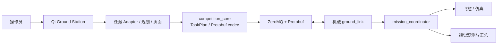

# NUEDC Ground Station

面向无人机竞赛任务的 Qt 6 地面站。它负责任务规划、操作员交互、任务状态展示，以及
与机载端的外部通信。当前内置的任务 Adapter 是 2025 年电赛 H 题野生动物巡查。

地面站与机载端通过 ZeroMQ 和 Protobuf 通信，但任务、页面和规划逻辑不依赖具体飞控
实现。新增题目应新增 Adapter，而不是复制地面站 Shell。

## 目录

- [能力与边界](#能力与边界)
- [架构](#架构)
- [环境与构建](#环境与构建)
- [启动与联调](#启动与联调)
- [操作流程](#操作流程)
- [通信合约](#通信合约)
- [目录结构](#目录结构)
- [测试与开发](#测试与开发)
- [相关文档](#相关文档)

## 能力与边界

| 范围 | 说明 |
| --- | --- |
| 任务规划 | H 题 Adapter 负责禁飞区、航线、终点和任务计划校验。 |
| 操作员界面 | Qt 页面展示地图、航线、当前位置、检测结果和最终汇总。 |
| 外部通信 | 使用 `shared/proto/messages.proto` 定义的 Protobuf `Envelope`，通过 ZeroMQ 与机载端交互。 |
| 状态展示 | 命令可用性以 PING 或命令 Ack 为准；遥测本身不表示命令通道可用。 |
| 扩展方式 | 新赛题新增 `CompetitionTaskAdapter`，题目专有解析和 UI 不写入 Shell 或 `competition_core`。 |

地面站不拥有机载任务状态。`plan_revision`、`execution_id`、`vision_epoch` 和已接受
command sequence 的权威在机载 `mission_coordinator`；地面站只发送命令并消费 Ack、
事件与汇总。

## 架构



`shared/proto/messages.proto` 是跨端 wire 合约。修改字段、字段号、Ack 语义或 legacy
JSON 前，必须同时验证机载端与地面站的兼容性。

## 环境与构建

### 依赖

- Linux 开发环境、C++17 和 CMake 3.16 或更高版本
- Qt 6：Core、Widgets、Sql、Test
- Protobuf 编译器和 C++ 库
- ZeroMQ 与 cppzmq 头文件

Ubuntu 22.04 的典型依赖安装命令如下。包名可能因发行版而异：

```bash
sudo apt update
sudo apt install -y \
  build-essential cmake qt6-base-dev \
  libprotobuf-dev protobuf-compiler \
  libzmq3-dev cppzmq-dev
```

### 获取与构建

```bash
git clone https://github.com/Wanqiq7/NUEDC_Test.git
cd NUEDC_Test
cmake -S . -B build -DCMAKE_BUILD_TYPE=Release
cmake --build build --parallel 2
```

构建会从 `shared/proto/messages.proto` 生成 C++ Protobuf 代码到
`build/generated/proto/`。不要直接编辑生成文件。

## 启动与联调

### 启动地面站

```bash
./build/ground_station_computer/ground_station_app
```

默认连接本机机载端：遥测/事件端口 `5557`，命令端口 `5558`。双 NUC 部署时，在
启动前设置机载端地址和可选端口：

```bash
export NUEDC_AIRBORNE_HOST=192.168.10.20
export NUEDC_TELEMETRY_PORT=5557
export NUEDC_COMMAND_PORT=5558
./build/ground_station_computer/ground_station_app
```

端口与机载 `airborne_bringup` 的默认值相同。确认防火墙和网络路由允许这两个 TCP
端口后，再进行跨机联调。

### 先验证机载链路

在界面中使用“刷新机载链路”发送 PING。只有收到有效 Ack 后，才应开始执行、视觉
ARM 或 RESET 操作。命令超时后可以重试，但不要用收到的遥测替代命令通道健康状态。

所有命令回复均使用 `Envelope.ack`。对于 `ARM_TARGETING` 与 `RESET_TARGETING`，机载端必须在
处理命令后返回当前完整状态：`success`、`message`、`task_id`、`mission_loaded`、
`mission_running`、`last_accepted_sequence` 和 `vision_armed`。`last_accepted_sequence` 必须是
已经接受的命令序列号；地面站用它和 `vision_armed` 判断超时重试是否已被机载端接收。命令链路
健康状态只由命令 Ack 和后台 PING 建立或更新，遥测永远不能建立命令链路健康状态，也不代表 REQ/REP
命令端口可用。后台 PING 每两秒自动运行；`刷新机载链路` 仅请求一次立即探测，保持在线不需要点击该按钮。

## 操作流程

1. 启动地面站并确认机载链路为可用状态。
2. 加载或规划任务；H 题中可通过“设置禁飞区”选择 3 个横向或纵向连续方格。
3. 生成航线并检查禁飞区、覆盖范围、起点和终点。
4. 通过 `mission_load` 下发 `TaskPlan`，等待 Ack 确认已加载。
5. 使用 START、ARM、RESET、STOP 控制任务，观察当前方格、检测记录和汇总。
6. 任务结束后核对汇总与本地检测数据库；运行时计划写入
   `runtime/active_mission_plan.json`。

## 通信合约

| 接口 | 方向 | 用途 |
| --- | --- | --- |
| `tcp://<airborne>:5557` | 机载 -> 地面站 | PUB：telemetry、observation、summary。 |
| `tcp://<airborne>:5558` | 地面站 -> 机载 | REQ/REP：MISSION_LOAD、START、STOP、ARM、RESET、PING。 |
| `mission_load` | 命令 | 下发通用 `TaskPlan`。 |
| `COMMAND_TYPE_PING` | 命令 | 验证命令链路并获取当前上下文。 |
| `COMMAND_TYPE_START_MISSION` | 命令 | 仅当机载飞控 Action 接受任务后成功。 |
| `COMMAND_TYPE_STOP_MISSION` | 命令 | 请求取消当前任务；以机载 Ack 和终态为准。 |
| `COMMAND_TYPE_ARM_TARGETING` / `RESET_TARGETING` | 命令 | 启用或复位视觉瞄准会话。 |

ARM 和 RESET 的 Ack 必须携带完整当前状态，包括 `task_id`、任务是否加载/运行、
`last_accepted_sequence` 与 `vision_armed`。地面站以这些字段判断重试是否已经被
机载端接受。

## 目录结构

```text
NUEDC_Test
├── shared
│   ├── proto/                 # Protobuf wire 合约
│   ├── cases/                 # 固定联调案例
│   └── cpp/                   # competition_core 与 H 题核心
├── ground_station_computer
│   ├── src/                   # Qt Shell、Adapter、H 题页面
│   └── tests/                 # Qt Test 测试
├── runtime/                   # 当前运行时任务计划
└── docs/                      # 架构、网络、Adapter 开发文档
```

## 测试与开发

在无图形环境下运行测试：

```bash
QT_QPA_PLATFORM=offscreen ctest --test-dir build -j1 --output-on-failure
```

地面站测试覆盖协议编解码、网络配置、命令客户端、任务状态、规划与主要页面行为。
修改 `messages.proto`、任务计划格式或网络端点时，应同时运行对应的共享核心和 UI 测试。

开发约束：

- 保持 C++17、四空格缩进、`snake_case` 文件名和 `PascalCase` 类型名。
- 不提交 `build/` 或生成的 Protobuf 文件。
- 新任务先实现 Adapter；共享协议变化应优先保持向后兼容。
- UI 变更提交前使用 offscreen 测试，涉及交互时附运行截图或录屏说明。

## 相关文档

- [双 NUC 部署与网络](docs/dual_nuc_setup_guide.md)
- [地面站框架架构](docs/framework_architecture.md)
- [新增任务 Adapter](docs/adding_task_adapter.md)
- [地面站架构规格](docs/ground_station_architecture_spec.md)
- [共享 C++ 核心](shared/cpp/README.md)
