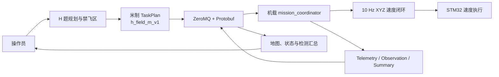
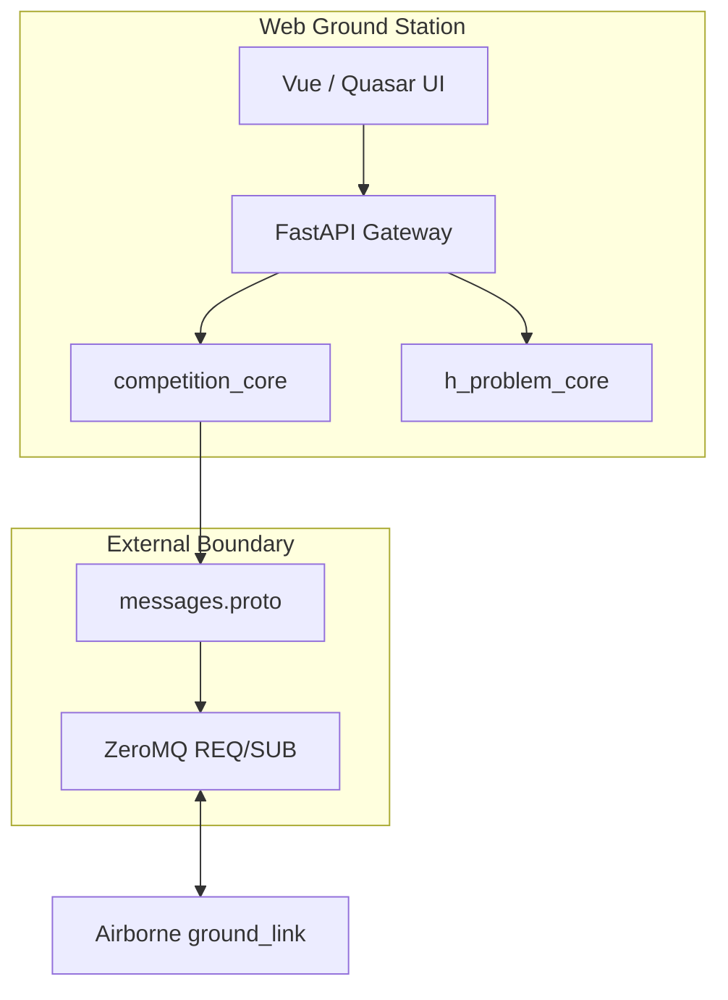

<div align="center">

# NUEDC GROUND STATION

**面向无人机竞赛任务规划与执行监控的 Web 地面站**

<p>
  
  
  
  
</p>

</div>

---

# 项目简介

NUEDC Ground Station 是面向无人机竞赛任务的 Web 地面站，由 FastAPI Gateway、
Vue 3/Quasar 主控台、C++ H 题规划核心和 ZeroMQ/Protobuf 机载协议组成。

标准比赛入口是 `http://10.42.0.1:8000`。

地面站负责案例加载、禁飞区编辑、航线生成与校验、任务下发和结果展示，但不负责机载
飞行决策。任务下发后，机载 `mission_coordinator` 根据 LIO 定位运行速度闭环；STM32
只执行机体系 XYZ 速度。地面站与机载端通过 ZeroMQ 和 Protobuf 通信，新增赛题应扩展
对应的 Gateway 转换和前端面板，而不是修改通用核心。

本仓库的软件闭环覆盖 H 题的禁飞区规划、非禁飞格覆盖、120 cm 巡查高度、动物检测事件
传输与结果汇总，以及 `takeoff -> navigate -> land` 任务执行。动物识别模型、LIO、串口
固件和最终飞行精度属于部署条件，不能由地面站单元测试单独证明。

---

# 目录

- [亮点](#亮点)
- [功能模块](#功能模块)
- [依赖](#依赖)
- [Quick Start](#quick-start)
- [操作与联调](#操作与联调)
- [任务与通信合约](#任务与通信合约)
- [配置与运行时文件](#配置与运行时文件)
- [数据流图](#数据流图)
- [软件架构](#软件架构)
- [文件结构](#文件结构)
- [测试与开发](#测试与开发)
- [相关文档](#相关文档)

---

# 亮点

- **规划与执行职责分离**

  地面站生成并校验任务计划；机载端推进任务、运行 PID 并发布速度；STM32 不解析
  航点或任务状态。

- **明确的 H 题米制契约**

  规划几何继续使用厘米，只有在构造 `TaskPlan` 时统一转换为场地系米制坐标，并以
  `h_field_m_v1` 拒绝旧版本计划。

- **下降起点与真实触地点分离**

  地图分别显示最后巡查格、下降起点和真实降落终点，避免把最后巡查格误认为触地点。

- **可重复的双端联调**

  提供固定案例、runtime plan、mock airborne 自测和完整 Web/协议测试，可从无机载端
  的本地验证逐步扩展到双 NUC 联调。

- **明确的验证边界**

  规划器、协议编解码和 Web 页面可在本地验证；300 s 内完成、航线偏差、定高误差和落点
  误差必须在目标机载硬件与实际场地上单独测量。

---

# 功能模块

| 模块 | 主要目录 | 说明 |
| :--- | :--- | :--- |
| Web 主控台 | `web_ground_station/` | FastAPI Gateway、Vue/Quasar 单页主控、离线启动和浏览器测试。 |
| 通用任务核心 | `shared/cpp/include/competition_core`、`shared/cpp/src` | 定义 `TaskPlan`、任务存储、命令与 Protobuf codec。 |
| H 题核心 | `shared/cpp/include/h_problem_core`、`shared/cpp/src` | 负责案例、禁飞区、航线规划、坐标转换和 45° 降落几何。 |
| Wire 合约 | `shared/proto/messages.proto` | 定义跨地面站与机载端的 Protobuf `Envelope`。 |
| 测试与案例 | `web_ground_station/tests`、`shared/cpp/tests`、`shared/cases` | 提供 UI、协议、规划与固定联调案例。 |

---

# 依赖

## 基础环境

- Linux 开发环境
- C++17
- CMake 3.16 或更高版本
- Qt 6 Core、Test（仅供 C++ 规划核心使用）
- Protobuf 编译器与 C++ 库
- ZeroMQ 与 cppzmq

Ubuntu 22.04 的典型安装命令：

```bash
sudo apt update
sudo apt install -y \
  build-essential cmake qt6-base-dev \
  libprotobuf-dev protobuf-compiler \
  libzmq3-dev cppzmq-dev
```

---

# Quick Start

## 获取与构建

```bash
git clone https://github.com/Wanqiq7/NUEDC_Test.git
cd NUEDC_Test
cmake -S . -B build -DCMAKE_BUILD_TYPE=Release
cmake --build build --parallel 2
```

构建会根据 `shared/proto/messages.proto` 在 `build/generated/proto/` 生成 C++ 文件。
不要直接编辑或提交生成文件。

## 启动地面站

比赛默认启动 Web 地面站。先构建 C++ 规划器和静态前端，再执行离线预检：

```bash
cd web_ground_station/frontend
corepack pnpm install --offline --frozen-lockfile
corepack pnpm build
cd ../..
source runtime/web_ground_station.env
web_ground_station/scripts/check_web_ground_station.sh
web_ground_station/scripts/start_competition.sh
```

在 Chromium 打开 `http://10.42.0.1:8000`。完整开发、应急 STOP、PlotJuggler PID 诊断和
离线验收命令见 [Web 地面站操作手册](web_ground_station/README.md)。

## 无机载端自测

```bash
python3 scripts/mock_airborne.py --self-test \
  --runtime-path /tmp/nuedc-mock-self-test-plan.json
```

---

# 操作与联调

## 标准操作流程

1. 首次部署时分别运行地面站 `start_ground_hotspot.sh` 和机载端
   `connect_ground_hotspot.sh`；日常联调使用机载端 `start_airborne_integration.sh`
   和地面站 `web_ground_station/scripts/start_competition.sh` 启动双端。
2. 使用“刷新机载链路”发送 PING。
3. 加载 H 题案例或设置 3 个横向/纵向连续禁飞格。
4. 生成航线，核对起飞点、巡查顺序、下降起点与降落终点。
5. 下发 `mission_load`，等待 Ack 确认任务已加载。
6. 发送 START；机载端会自动开启本次执行的视觉 epoch，无需再手动发送 ARM。
7. 观察当前位置、航点进度、检测记录与终态 Summary；必要时发送 STOP。
8. 任务结束后核对本地检测数据库和 `runtime/active_mission_plan.json`。

遥测不代表命令通道可用。命令链路健康状态只由命令 Ack 与后台 PING 建立；后台
PING 每两秒运行一次，“刷新机载链路”只触发一次立即探测。

## 双仓部署顺序

`h_field_m_v1` 必须与机载速度控制器原子部署：

1. 构建并测试机载端，确认 LOAD 契约门禁和 live simulation 通过。
2. 构建并测试本仓库，确认计划、协议和 UI 测试通过。
3. 在同一部署窗口更新机载端与地面站。
4. 先用 PING 和 MISSION_LOAD 验证链路，再执行真实任务。

机载端未升级完成前，不要单独部署这版地面站任务计划。

---

# 任务与通信合约

## H 题执行坐标

H 题执行契约为 h_field_m_v1。TaskWaypoint 使用米，A9B1 格心为原点，
+X: B1 -> B7，+Y: A9 -> A1。执行序列为 takeoff -> navigate -> land；
terminal_waypoint_id=touchdown 表示最终落点，metadata_json.terminal_cell
表示最后巡查格。START 由机载 mission_coordinator 直接接受并运行速度闭环，
不再调用 /nuedc/execute_mission Action。

规划器、禁飞区和 UI 仍使用厘米。`TaskWaypoint.x/y/z` 只在计划生成边界转换为米；
`touchdown_x_cm`、`touchdown_y_cm` 等带 `_cm` 后缀的 metadata 保持厘米。

## ZeroMQ 与命令

| 接口 | 方向 | 用途 |
| :--- | :--- | :--- |
| `tcp://<airborne>:5557` | 机载 -> 地面站 | PUB：telemetry、observation、summary。 |
| `tcp://<airborne>:5558` | 地面站 -> 机载 | REQ/REP：MISSION_LOAD、START、STOP、ARM、RESET、PING。 |
| `mission_load` | 命令 | 下发通用 `TaskPlan`。 |
| `COMMAND_TYPE_PING` | 命令 | 验证命令链路并获取当前任务上下文。 |
| `COMMAND_TYPE_START_MISSION` | 命令 | 由 `mission_coordinator` 直接启动速度闭环。 |
| `COMMAND_TYPE_STOP_MISSION` | 命令 | 请求进入不可恢复 Cancelled 终态并安全下降。 |
| `COMMAND_TYPE_ARM_TARGETING` | 兼容命令 | 手动开启视觉 epoch；正常一键流程由 START 自动完成。 |
| `COMMAND_TYPE_RESET_TARGETING` | 命令 | 复位并创建新的视觉 epoch。 |

`plan_revision`、`execution_id`、`vision_epoch` 和已接受 command sequence 的权威均在
机载 `mission_coordinator`。地面站只发送命令并消费 Ack、事件与 Summary。

---

# 配置与运行时文件

| 文件或环境变量 | 作用 |
| :--- | :--- |
| `shared/cases/sample_case.json` | H 题固定规划与联调案例。 |
| `runtime/active_mission_plan.json` | 当前生成并准备下发的任务计划。 |
| `NUEDC_AIRBORNE_HOST` | 机载端地址，默认本机。 |
| `NUEDC_TELEMETRY_PORT` | 事件 SUB 端口，默认 `5557`。 |
| `NUEDC_COMMAND_PORT` | 命令 REQ 端口，默认 `5558`。 |

修改 `messages.proto`、案例文件或 runtime plan 兼容规则时，必须同步验证机载仓中的
同名 Protobuf 源文件与 wire golden。

---

# 数据流图



---

# 软件架构



题目专有的解析、规划和 UI 属于题目 core、Gateway 转换和前端面板；通用任务模型和 wire codec 属于共享核心；
跨端通信必须经过 `messages.proto`，不得把机载任务状态复制成地面站本地权威。

---

# 文件结构

```text
NUEDC_Test
|-- README.md
|-- CMakeLists.txt
|-- shared
|   |-- proto                  # Protobuf wire 合约
|   |-- cases                  # 固定联调案例
|   `-- cpp
|       |-- include
|       |   |-- competition_core  # 通用任务与协议接口
|       |   `-- h_problem_core    # H 题规划与几何接口
|       |-- src                   # 两个共享库的实现
|       `-- tests                 # 共享核心测试
|-- web_ground_station       # Web Gateway、SPA、启动脚本和 E2E
|-- runtime                   # 当前运行时计划
|-- scripts                   # mock 与开发工具
`-- docs                      # 架构、部署与扩展文档
```

---

# 测试与开发

## 完整验证

```bash
cmake -S . -B build
cmake --build build
ctest --test-dir build -j1 --output-on-failure
python3 scripts/mock_airborne.py --self-test \
  --runtime-path /tmp/nuedc-mock-self-test-plan.json
```

## 开发约束

- 使用 C++17、四空格缩进、`snake_case` 文件名和 `PascalCase` 类型名。
- 不直接编辑或提交 `build/generated/proto/`。
- 新赛题在 Web Gateway 和前端面板中扩展，不要把题目逻辑写入
  `competition_core`。
- 协议、坐标或计划变更必须覆盖 round-trip、错误路径和边界值。
- UI 变更至少运行 Vitest、类型检查和生产构建；涉及交互时在 PR 中附截图或录屏。

---

# 相关文档

- [双 NUC 部署与网络](docs/dual_nuc_setup_guide.md)
- [Web 地面站操作手册](web_ground_station/README.md)
- [共享 C++ 核心](shared/cpp/README.md)
