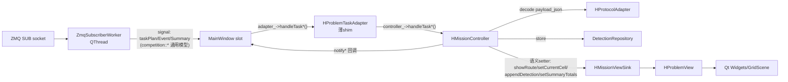
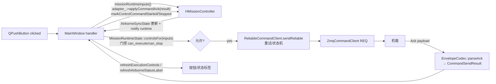

# 地面站系统架构与上下文传递规范

> 受众：接替本工作的 AI Agent。目标：读完即可安全地在本系统新增功能而不破坏现有逻辑。
> 校验基线：clean rebuild + `ctest` **32/32 全绿**（Ground 侧）。所有签名/路径均按当前代码逐行核对，非记忆。

---

## 1. 架构总览 (Architecture Overview)

**核心职责一句话**：一个「通用无人机竞赛地面站框架 + H 题（野生动物巡检）插件」的分层系统——Shell 负责通用连接/执行控制与任务下发，题目 Adapter 以插件形式提供页面、规划、状态解释与题目私有协议解码；框架对题目零硬编码，靠注册表 + 环境变量选择题目。

**技术栈与关键依赖**：

| 项 | 版本/约束 |
|---|---|
| 语言 | C++17 (`CMAKE_CXX_STANDARD 17`, REQUIRED) |
| GUI | Qt6 (`Core Widgets Sql Test`)，`CMAKE_AUTOMOC ON` |
| 传输 | ZeroMQ (`libzmq` + `cppzmq` header `zmq.hpp`) |
| 序列化 | Protobuf（`messages.proto` → `protoc` 生成 `proto_messages` STATIC lib） |
| 持久化 | Qt SQL（`DetectionRepository`），JSON（任务计划落盘） |
| 构建 | CMake ≥ 3.16 + Ninja |
| 测试 | QtTest（`ground_station_computer/tests/test_*.cpp`，`add_ground_station_test` 注册；`QT_QPA_PLATFORM=offscreen`，`WORKING_DIRECTORY=PROJECT_SOURCE_DIR`） |
| 工具链 | MSYS2 UCRT64 已装齐，可本机 `cmake+ninja` 构建（见 build-toolchain 记忆） |

**顶层 target 图**（`Ground/CMakeLists.txt`）：
```
proto_messages (STATIC, protoc 生成)
  └─ shared/cpp            → competition_core + h_problem_core (add_subdirectory)
       └─ ground_station_computer (add_subdirectory)
```

---

## 2. 目录结构与语义映射 (Directory & Semantic Mapping)

```
Ground/
├─ shared/proto/messages.proto        # 协议单一定义源（有三份镜像副本，见 §6）
├─ shared/cpp/                         # 硬件无关的纯逻辑内核，可独立单测
│  ├─ include/competition_core/        # 【通用内核】仅通用模型/协议/端口，禁止 include 任何题目
│  │  ├─ task/models.h                 #   TaskPlan/TaskEvent/TaskSummary/AckResult/CommandState（通用传输模型）
│  │  ├─ task/task_ports.h             #   TaskPlanner/TaskCodec 抽象端口
│  │  ├─ protocol/envelope_codec.h     #   taskPlanToMessage/taskEventToMessage/... 通用↔protobuf 转换
│  │  ├─ protocol/command_handler.h    #   机载侧命令处理（地面站不直接用）
│  │  └─ storage/json_codec.h, mission/task_plan_store.h  # 通用 TaskPlan JSON 落盘（唯一长期格式）
│  └─ include/h_problem_core/          # 【H题内核】题目算法，可依赖 competition_core，反向禁止
│     ├─ mission/case_loader.h, mission_planning.h  # 案例加载 + buildTaskPlan（规划主入口）
│     ├─ planning/route_planner.h, route_cost.h, mission_geometry.h  # 路径规划算法
│     └─ protocol/envelope_builder.h   #   H题 payload↔通用模型转换（复用 competition_core 符号）
│
└─ ground_station_computer/
   ├─ src/app/                         # 【Shell】通用外壳，禁止 include 任何 h_problem/* 头
   │  ├─ main.cpp                      #   QApplication 入口
   │  └─ main_window.{h,cpp}           #   控制反转宿主：持 adapter 指针 + 通信客户端；只调通用接口
   ├─ src/framework/                   # 【框架层】通用能力，禁止写题目规则
   │  ├─ task/competition_task_adapter.h        # 核心接口 CompetitionTaskAdapter（题目↔Shell 唯一边界）
   │  ├─ task/competition_task_registry.{h,cpp} # 注册表 + 工厂 + 默认id单一真源；唯一允许 framework→题目 的 include
   │  ├─ communication/zmq_subscriber_worker.*  # 订阅线程：只发通用 TaskPlan/Event/Summary 信号，禁解析题目payload
   │  ├─ communication/reliable_command_client.* # 带重试/状态机的命令下发（CommandTransport 抽象）
   │  ├─ communication/zmq_command_client.*, envelope_codec.*, message_dispatcher.*  # 命令通道 + Ack 解析
   │  ├─ config/network_config.*        #   端点配置（环境变量）
   │  ├─ config/repository_paths.*      #   仓库根探测单一真源（RepositoryPaths::root/resolve）
   │  └─ runtime/mission_runtime_state.*, airborne_sync_state.*  # 纯值状态类型（无UI，可单测）
   └─ src/h_problem/                   # 【H题插件】题目页面/规则/存储/规划入口，全部题目私有逻辑在此
      ├─ h_problem_adapter_registration.h       # 唯一对框架暴露的入口：hProblemTaskAdapterDescriptor()
      ├─ ui/h_problem_page.{h,cpp}     #   HProblemTaskAdapter：薄 shim（102行），装配 view+controller 并转发
      ├─ ui/h_problem_view.{h,cpp}     #   被动视图，实现 HMissionViewSink，只建控件树+语义setter，无逻辑
      ├─ ui/h_grid_scene.*, h_route_visualizer.*  # 网格/航线绘制（QGraphicsScene）
      ├─ mission/h_mission_controller.{h,cpp}   #   工作流控制器：状态/解码/规划/持久化，经 sink 驱动UI
      ├─ mission/h_mission_view_sink.h #   控制器→视图的窄接口（IoC 点，可 mock 单测）
      ├─ mission/h_protocol_adapter.*  #   题目 payload_json 解码（telemetry/detection/summary/gridconfig）
      ├─ mission/h_route_planner_bridge.* #  TaskPlanningResult + generatePlan（进程内调 h_problem_core）
      ├─ mission/h_mission_command_service.*  # 封装 ReliableCommandClient 做任务/控制下发
      ├─ mission/h_no_fly_planning_state.*    # PlanningStateMachine（规划按钮 UI 状态机）
      ├─ mission/h_mission_load_adapter.*     # 任务计划加载适配
      ├─ rules/h_grid_mapper.*, h_no_fly_zone_rules.*, h_route_validator.*  # 题目校验规则（纯函数）
      └─ storage/h_detection_repository.*, h_mission_plan_store.*  # 检测记录DB + 计划落盘
```

**关键语义边界**：
- `competition_core` **不负责**任何题目算法；`h_problem_core` **不负责**通信/UI；`framework` **不负责**题目规则；`h_problem` **不负责**通用连接与执行控制。
- `h_mission_controller` **负责**全部 H 题工作流状态，**不负责**构造任何 Qt 控件（只经 `HMissionViewSink` 下发语义指令）。
- `h_problem_view` **负责**控件树与显示，**不负责**任何决策/网络/存储。

---

## 3. 核心依赖图与数据流 (Dependencies & Data Flow)

### 控制反转点 / 核心接口
1. **`CompetitionTaskAdapter`**（`framework/task/competition_task_adapter.h`）：Shell 与题目的唯一交互抽象。`MainWindow` 只持 `std::unique_ptr<CompetitionTaskAdapter>`，永不知道 H 题类型。
2. **工厂注入根**：`createConfiguredCompetitionTaskAdapter()`（读 `NUEDC_TASK_ADAPTER` 环境变量，缺省 `defaultCompetitionTaskAdapterId()=="h_problem"`）。这是 framework→题目 唯一允许的编译期依赖（`competition_task_registry.cpp` include `h_problem_adapter_registration.h`）。
3. **`HMissionViewSink`**（`h_problem/mission/h_mission_view_sink.h`）：控制器→视图的窄接口，`HProblemView` 实现它，控制器仅依赖接口 → 可用 mock sink 单测（`test_h_mission_controller.cpp`）。
4. **回调注入**：Adapter 基类持 3 个 `std::function`（statusText / planningButtonText / runtime），由 `MainWindow` 注入；`HMissionController` 构造时接收同样 3 个回调 + sink 指针。事件总线角色由 Qt signal/slot（订阅线程→MainWindow）承担。

### 上行数据流（机载 → 地面 UI）


### 下行数据流（操作员 → 机载，执行/停止/规划）


### 规划数据流（进程内，无子进程）
`HMissionController::generateTaskPlanFromCandidateSelection()` → `HRoutePlanner::generatePlan(case_path, no_fly_cells)` → `hcore::loadCase` + `hcore::buildTaskPlan`（`h_problem_core` 纯算法）→ `competition::TaskPlan` → `sink_->showRoute()` + `storeTaskPlan` 落盘 + 可选 `MissionCommandService::sendTaskPlan()`。

> 注意：`HRoutePlanner` 是**进程内直接调用** `h_problem_core`，不是外部 planner 进程，也不接受旧 JSON 规划输出。

---

## 4. 接口与状态契约 (Interfaces & State Contracts)

H 题执行契约为 h_field_m_v1。TaskWaypoint 使用米，A9B1 格心为原点，
+X: B1 -> B7，+Y: A9 -> A1。执行序列为 takeoff -> navigate -> land；
terminal_waypoint_id=touchdown 表示最终落点，metadata_json.terminal_cell
表示最后巡查格。START 由机载 mission_coordinator 直接接受并运行速度闭环，
不再调用 /nuedc/execute_mission Action。

该契约必须原子部署：机载端最终系统测试通过前，不得单独部署这版地面站契约；
地面站与机载端的 LOAD 契约门禁和速度控制器必须在同一部署窗口上线。

### 4.1 `CompetitionTaskAdapter`（纯虚，题目必须实现）
```cpp
// 回调注入（基类提供）
void setStatusTextCallback(TextCallback);        // std::function<void(const QString&)>
void setPlanningButtonTextCallback(TextCallback);
void setRuntimeCallback(RuntimeCallback);        // std::function<void()>

// 查询
virtual QWidget *createTaskView(QWidget *parent) = 0;
virtual QString initialPlanningButtonText() const = 0;
virtual QString activeTaskId() const = 0;
virtual bool missionSyncedToAirborne() const = 0;
virtual bool missionRunning() const = 0;
virtual MissionRuntimeInputs missionRuntimeInputs() const = 0;

// 配置 / 生命周期 / 事件
virtual void setCommandSyncEnabled(bool) = 0;
virtual void setCommandClient(const ZmqCommandClient&) = 0;
virtual void loadInitialPreview() = 0;
virtual void handleTaskPlan(const competition::TaskPlan&) = 0;
virtual void handleTaskEvent(const competition::TaskEvent&, qint64 timestamp_ms) = 0;
virtual void handleTaskSummary(const competition::TaskSummary&) = 0;
virtual void handlePlanningButtonClicked() = 0;
virtual void markControlCommandStarted() = 0;
virtual void markControlCommandStopped() = 0;
virtual void markAirborneSyncState(bool online, bool synced) = 0;
virtual void applyCommandAck(const CommandSendResult&) = 0;
```

### 4.2 注册契约
```cpp
// 题目侧唯一暴露（h_problem_adapter_registration.h）
CompetitionTaskAdapterDescriptor hProblemTaskAdapterDescriptor();
struct CompetitionTaskAdapterDescriptor { QString adapter_id; QString display_name;
    std::function<std::unique_ptr<CompetitionTaskAdapter>()> create; };
// 框架侧工厂（competition_task_registry.{h,cpp} 及 competition_task_adapter.h 声明）
QVector<CompetitionTaskAdapterDescriptor> availableCompetitionTaskAdapters();
QString defaultCompetitionTaskAdapterId();               // "h_problem"，单一真源
std::unique_ptr<CompetitionTaskAdapter> createCompetitionTaskAdapter(const QString& id, QString* err=nullptr);
std::unique_ptr<CompetitionTaskAdapter> createConfiguredCompetitionTaskAdapter(QString* err=nullptr); // 读 NUEDC_TASK_ADAPTER
std::unique_ptr<CompetitionTaskAdapter> createDefaultCompetitionTaskAdapter();
```

### 4.3 `HMissionViewSink`（控制器→视图窄接口，9 个语义方法）
```cpp
setCaseLabel(QString) / setMissionLabel(QString) / setTargetStatus(QString)
showRoute(no_fly, route, start, descent_start_cell,
          touchdown_x_cm, touchdown_y_cm, landing_enabled)
enterNoFlyEditMode() / setCandidateCells(QStringList) / setCurrentCell(QString)
appendDetection(QString) / setSummaryTotals(QMap<QString,int>)
```

`descent_start_cell` 是最后巡查格，也是下降起点；`touchdown_x_cm/touchdown_y_cm`
是独立的真实降落终点。视图分别绘制“下降起点”和“降落终点”及二者之间的下降连线，
不得用坐标是否为零推断降落终点是否存在。

### 4.4 命令/状态值类型
```cpp
struct CommandSendResult { bool ok; QString message, task_id; bool mission_loaded, mission_running;
    quint64 last_accepted_sequence; };                    // framework/communication/envelope_codec.h
struct MissionRuntimeInputs { bool command_sync_enabled, airborne_online, mission_synced_to_airborne,
    mission_running; QString active_task_id, acknowledged_task_id; bool acknowledged_mission_loaded;
    quint64 last_accepted_sequence; };
struct MissionRuntimeControls { bool can_execute, can_stop; };
// 无状态纯函数：
MissionRuntimeControls MissionRuntimeState::controlsFor(const MissionRuntimeInputs&);   // static
QString MissionRuntimeState::airborneStatusText(const MissionRuntimeInputs&);           // static
```

### 4.5 状态管理机制（关键）
| 状态 | 归属 | 性质 |
|---|---|---|
| H 题任务全量状态（case/start/terminal/候选&已提交禁飞格/降落参数/检测汇总） | `HMissionController` 私有成员 | 有状态，单实例 |
| 机载同步/Ack 态（synced/running/ack_task_id/loaded/last_seq） | `AirborneSyncState`（controller 内成员 `sync_state_`） | 纯值类型，含 invalid-ack guard；`clearAck()` 只清 ack，`reset()` 清全部 |
| 规划按钮 UI 状态 | `PlanningStateMachine`（controller 内 `planning_state_`） | 有状态 |
| `command_sync_enabled_` / `airborne_online_` | **`MainWindow`** 持有 | `airborne_online_` 仅 Shell 知道（探测结果）；controller 的 `missionRuntimeInputs()` 里 `airborne_online` 恒为 false，由 MainWindow 在 `refresh*()` 里覆盖后再喂给 `MissionRuntimeState` |
| `MissionRuntimeState` / `AirborneSyncState` / `NoFlyZoneRules` / `RepositoryPaths` | — | **无状态**（static 纯函数 / 值类型 / 纯逻辑） |
| 仓库根路径 | `RepositoryPaths::root()` | 进程内缓存（static），按 `shared/cases` + `ground_station_computer/src` 目录存在性探测 |

---

## 5. 扩展点与修改指南 (Extension Points & Modification Rules)

### 开放-封闭边界

**新增一道题目（如 D 题）——只加文件，不改现有文件**：
1. `shared/cpp/include/d_problem_core/` + `src/`：题目案例模型、规划器、`competition::TaskPlan` 转换。可依赖 `competition_core`，**禁止**反向。
2. `ground_station_computer/src/d_problem/`：新建 `DProblemTaskAdapter : public CompetitionTaskAdapter`，实现全部纯虚方法。建议沿用 H 题的 **view + controller + sink** 三段式（薄 adapter / 被动 view / 工作流 controller）。
3. `d_problem/d_problem_adapter_registration.h`：暴露 `dProblemTaskAdapterDescriptor()`。
4. 在 `framework/task/competition_task_registry.cpp` 的 `availableCompetitionTaskAdapters()` 里 `descriptors.append(dProblemTaskAdapterDescriptor());` 并 include 其 registration 头。**这是唯一需要动的框架文件**。
5. 运行时 `NUEDC_TASK_ADAPTER=d_problem` 选择。
6. `ground_station_computer/tests/test_*.cpp` 补测：工厂注册、初始预览、任务生成、mission load、关键 UI 状态、controller（用 mock sink）。CMake 用 `add_ground_station_test(name tests/xxx.cpp)` 注册。

**在 H 题内新增能力**：
- 新增一个视图元素 → 加到 `HMissionViewSink` + `HProblemView`，控制器经 sink 调用。
- 新增工作流/状态 → 加到 `HMissionController`，**不要**回流到 `HProblemTaskAdapter`（boundary test 会拒绝）。
- 新增题目 payload 字段解析 → `HProtocolAdapter`。

### 🚫 Do Not Touch（绝对不改的核心逻辑）

| 区域 | 原因 |
|---|---|
| `competition_core/task/models.h` 的 `CommandState`（atomic 标量 flag + QMutex 管 `active_task_plan_`） | 刻意且正确的并发设计，`findings.md` 有记录；「统一同步范式」= 回归 |
| 机载 `handleEnvelopeCommand` 中 `output_path` 落盘位于 command_lock 临界区（与 stale 检查/sequence 接受同事务） | 剥离落盘会重新引入竞态 |
| `AirborneSyncState` 的 invalid-ack guard + `clearAck()`/`reset()` 语义区分 | `test_airborne_sync_state` 锁定；混淆二者破坏「同步但清 ack」场景 |
| `MainWindow`：禁 include `h_problem/*`；禁维护题目业务面板/统计表/题目专有槽 | `test_architecture_boundaries` 强制 |
| `framework/communication/*`：禁 include 任何题目目录；订阅层只发通用信号 | 同上 |
| 通用长期任务计划存储格式 = `competition::TaskPlan` JSON（题目私有字段进 `metadata_json`/`payload_json`） | 禁止引入第二套持久化格式；`docs/framework_architecture.md` + boundary test 锁定 |
| 三份 `messages.proto` 副本 + `competition_core`/`h_problem_core` 两端镜像 | 逐字节镜像，改一处必须同步全部（见 §6） |

### 回归门禁（提交前必跑）
```bash
cmake --build build
ctest --test-dir build --output-on-failure    # 期望 32/32
# 边界自检：
rg -n "h_problem/" ground_station_computer/src/app ground_station_computer/src/framework/communication   # 应为空
python3 ../scripts/check_proto_sync.py         # 若改了 proto
```
`test_architecture_boundaries.cpp` 是活的护栏（字符串扫描），含 10 条约束，其中 `hProblemAdapterIsThinShimOverControllerAndView` 锁定 MVC 拆分、`adapterRegistryLivesInFrameworkNotProblemModule` 锁定注册表归属。**改动若触发它，先想清楚是不是在破坏边界，而非改测试。**

---

## 6. 已知局限与技术债 (Known Constraints & Tech Debt)

**为快速实现做的妥协**：
1. **`airborne_online` 状态割裂**：controller 的 `missionRuntimeInputs()` 里 `airborne_online` 恒 false，真实值由 `MainWindow` 持有并在 `refreshExecutionControls`/`refreshAirborneStatusLabel` 里手动覆盖后再传给 `MissionRuntimeState`。改执行门控逻辑时若只看 controller 会误判——真相在 `MainWindow`。
2. **`HMissionController` 仍是较大类**（~458 行 .cpp，含全部 H 题字段）。已从原 691 行上帝对象拆出 view/sink，但 controller 本身尚未按「规划子域 / 遥测子域 / 命令子域」进一步拆分。
3. **`h_problem_page.cpp` 保留 `HProblemPage::createGridScene`** 静态工具，仅为 `test_grid_scene` 服务，不参与主流程；勿误以为它是装配路径。

**Pitfalls / Edge Cases**：
- **协议三副本无跨仓自动校验**：`messages.proto` 在 `Ground/shared/proto/`、`Airborne/shared/proto/`、`Airborne/.../nuedc_bridge/proto/` 三份；`competition_core`/`h_problem_core` 在 Ground 与 Airborne 各一份逐字节镜像。改任一协议/核心模型必须同步另一端并跑两端测试。Ground↔Airborne 是两个独立 git 仓库，仅 `scripts/check_proto_sync.py` 兜底 proto 一致性。对镜像树做**签名级重构**（改 `CommandState`/`command_handler` 接口）风险高：要同步 4+ 处 include、两端测试都过——非必要不做，先与用户确认。
- **测试运行目录敏感**：`loadInitialPreview()`/规划依赖 `WORKING_DIRECTORY=PROJECT_SOURCE_DIR` 才能定位 `shared/cases/sample_case.json`；`RepositoryPaths` 从可执行文件目录向上探测（≤8 层）标志目录，脱离仓库结构运行会回退到 CWD。
- **`RepositoryPaths::root()` 结果 static 缓存**：进程内首次调用后固定，测试中切换工作目录不会重探测。
- **`MissionCommandService` 值语义 + 内部 `unique_ptr<ZmqCommandTransport>`**：有自定义拷贝构造/赋值（因持 unique_ptr）。给它加成员时注意维护拷贝语义，否则悬垂 `active_transport_`。
- **网络端点默认 `127.0.0.1:5557/5558`**（`NetworkConfig`），本地环境；实机需 `NUEDC_*` 环境变量覆盖。
- **执行/停止命令走 `ReliableCommandClient`（带重试）**，任务计划下发走 `MissionCommandService`；两条命令路径并存，勿混用。

---

## 附：一分钟接手检查
- 想加题目 → §5 六步，只碰 `competition_task_registry.cpp` 一个框架文件。
- 想改 H 题 UI → 动 `HProblemView` + `HMissionViewSink`，别碰 adapter。
- 想改 H 题逻辑 → 动 `HMissionController`，别回流 adapter。
- 想改协议/核心模型 → 停，先读 §6 第 1 条，同步两端。
- 提交前 → `cmake --build build && ctest --test-dir build`（32/32），boundary test 亮红先反思边界。
